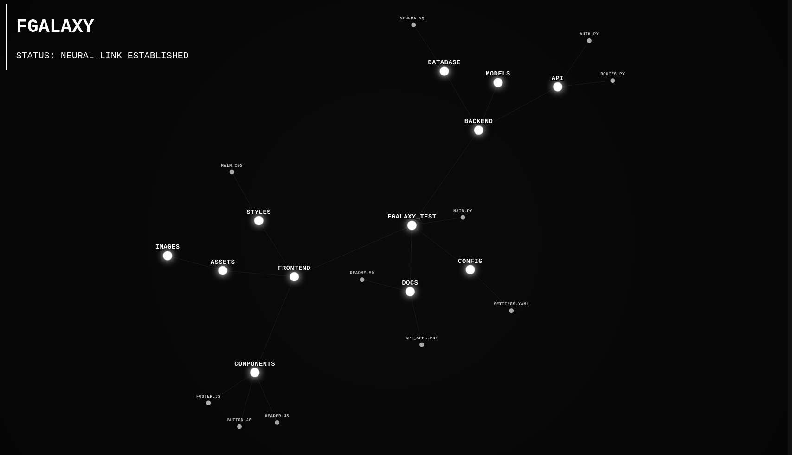

# 🌌 fGalaxy



A cinematic shell utility that transforms your file system into an interactive, physics-based constellation.

## Description
fGalaxy is an interactive directory visualizer designed for developers who want an aesthetic overview of their projects. It crawls your file system and generates a monochromatic "galaxy" where directories act as gravity hubs and files orbit as stars. Built with Python and D3.js, it provides a modern, interactive alternative to the standard `tree` command.
## Demo


## Installation
Execute the following command to download and install fGalaxy automatically:

```bash
curl -sSL https://raw.githubusercontent.com/xoodymoon/fgalaxy/main/install.sh | bash
```
**Note:** Requires `python`, `python-numpy`, and `git`.

## Usage

Navigate to any project directory and invoke the galaxy:
```Bash
fgalaxy
```
**Or**
```Bash
fgalaxy -a # Deep scan (includes hidden files)
```

##  Uninstall
To completely remove fGalaxy and its global command:
```bash
curl -sSL https://raw.githubusercontent.com/xoodymoon/fgalaxy/main/uninstall.sh | bash
```

## Technical Implementation

The tool uses a recursive Python walker to map the directory structure into a weighted JSON tree. A bridge script then flattens this data for a D3.js force-simulation engine, which handles the spatial physics and browser-based rendering.

License: MIT Author: xoodymoon
